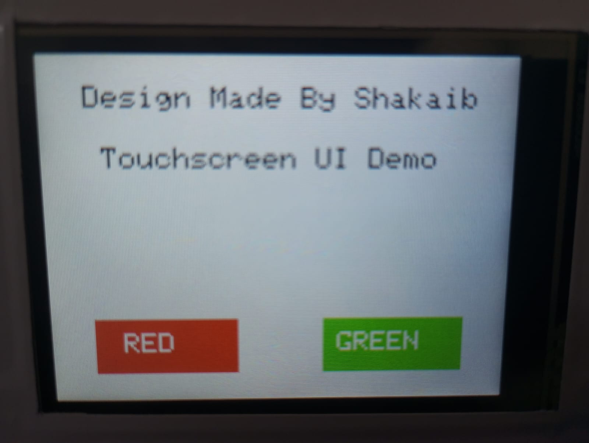
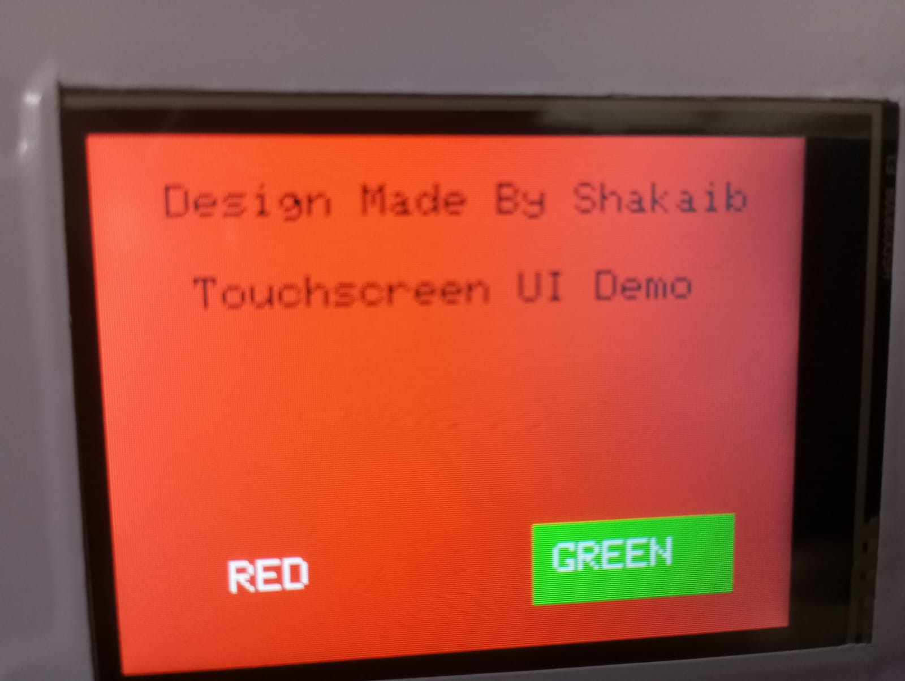
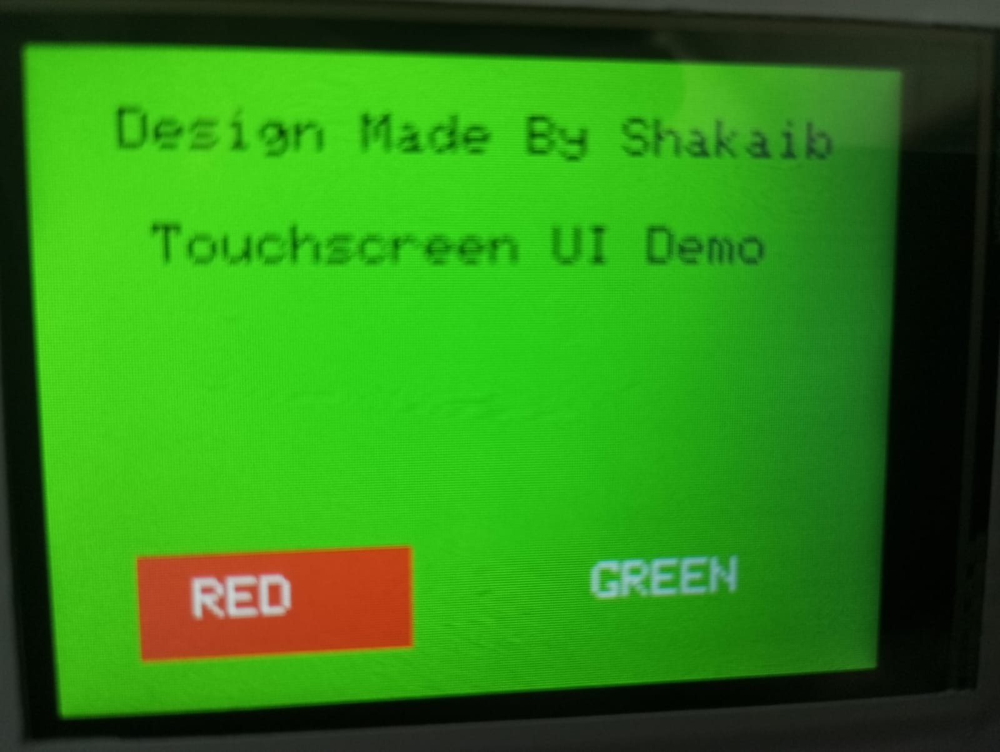

# ESP32 TFT LCD Touchscreen  UI Demo

This is a basic demo using an ESP32, an ILI9341 TFT display, and an XPT2046 touch controller. The screen shows two buttons — RED and GREEN. When you touch either one, the screen changes to that color and then goes back.

---

## 🛠 What You Need

- ESP32
- ILI9341 TFT screen (320x240)
- XPT2046 touch controller
- Jumper wires
- Arduino IDE with these libraries:
  - Adafruit GFX
  - Adafruit ILI9341
  - XPT2046_Touchscreen
  - SPI

---

## ⚡ Wiring

| Component      | ESP32 Pin |
|----------------|-----------|
| TFT CS         | 15        |
| TFT DC         | 2         |
| TFT RST        | 4         |
| Touch CS       | 21        |
| Touch IRQ      | 22        |
| SPI SCK        | 18        |
| SPI MISO       | 19        |
| SPI MOSI       | 23        |

Power everything with 3.3V and GND.

---

## 🎨 What It Does

- Shows the text: `Design Made By Shakaib`
- Two buttons on screen:
  - Tap RED → screen turns red
  - Tap GREEN → screen turns green
- After 300ms, it resets the UI

---

## ▶️ How To Use

1. Wire everything up.
2. Upload the code to your ESP32.
3. Touch the buttons and watch the screen change colors!

---

## 🙌 Made By

**Shakaib**

Feel free to use or modify it. No rules. Just build cool stuff.
